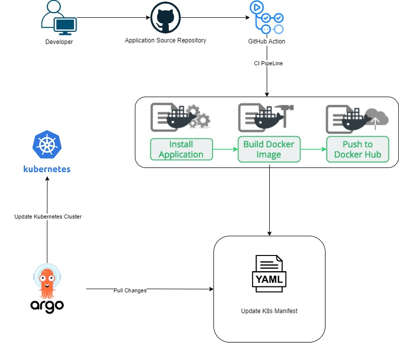

<h1>CI/CD with GitHub, GitHub Actions, Argo CD and Kubernetes Cluster</h1>

<h1>Setting Up a GitHub CI/CD Pipeline with Argo CD and Kubernetes</h1>

<h2>1. GitHub Repository:</h2>

Create a GitHub repository to store and version your application code.

<h2>2. GitHub Actions Workflow:</h2>

Configure GitHub Actions by creating a workflow file in <code>.github/workflows/</code>. This file orchestrates tasks like building the image, pushing to DockerHub, and adjusting the Kubernetes manifest for deployment.

<h2>3. GitHub Actions Runner:</h2>

Provision a GitHub Actions runner for executing tasks seamlessly within the workflow.

<h2>4. Kubernetes Cluster:</h2>

Deploy a Kubernetes cluster using your preferred service. GitHub Actions will interact with the cluster during workflow execution.

<h2>5. Argo CD Integration:</h2>

Install Argo CD on the Kubernetes cluster and connect it to your GitHub repository containing the Kubernetes manifest files.

<h2>6. Define Argo CD Application Resources:</h2>

Specify an Argo CD application to oversee the deployment of Kubernetes resources. Enable automatic synchronization to allow Argo CD to identify changes in the GitHub repository and initiate deployments accordingly.

<h2>7. Automate Deployment with Argo CD:</h2>

Leverage the automated capabilities of Argo CD to detect alterations in the GitHub repository and orchestrate the deployment of the updated application on the Kubernetes cluster.

<h1>Installing ArgoCD in Kubernetes Cluster</h1>

<h2>Installation Command:</h2>
<pre><code>kubectl create namespace argocd
kubectl apply -n argocd -f https://raw.githubusercontent.com/argoproj/argo-cd/stable/manifests/install.yaml</code></pre>

This command creates a namespace called <code>argocd</code> and deploys ArgoCD on your Kubernetes cluster using the installation manifests from the ArgoCD project's GitHub repository.

<h2>Verify Deployment:</h2>
<pre><code>kubectl get pods -n argocd</code></pre>

After running the installation command, check the status of the ArgoCD pods to ensure a successful deployment.

<h2>Access ArgoCD Dashboard:</h2>
<pre><code>kubectl port-forward svc/argocd-server -n argocd 8080:443</code></pre>

To access the ArgoCD dashboard, use port forwarding:

Access the ArgoCD Dashboard from your local machine using the following link: <a href="http://localhost:8080" target="_blank">http://localhost:8080</a>

